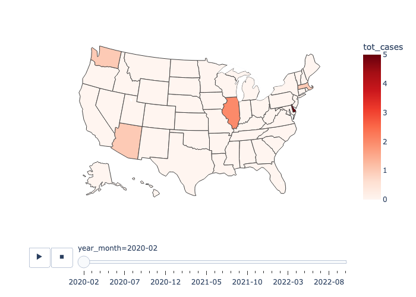
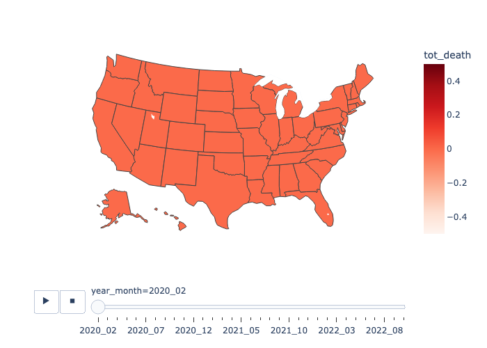
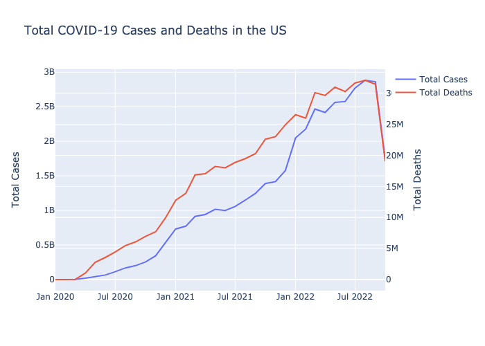

# Covid-19 Data Visualization

This project creates choropleth maps and line charts to visualize the total number of COVID-19 cases and deaths in the United States. The data used for the visualizations comes from the [CDC COVID Data Tracker](https://data.cdc.gov/Case-Surveillance/United-States-COVID-19-Cases-and-Deaths-by-State-o/9mfq-cb36).

## Requirements

This project requires the following packages:

- pandas
- plotly

You can install these packages by running:

```
pip install -r requirements.txt
```

## Usage

To use this project, follow these steps:

1. Run any of the Python files in the root directory. The scripts will generate a choropleth map or line chart and display it in your web browser.
2. If you want to customize the data, you can modify the `covid_data.csv` file.

### Example Outputs

#### COVID-19 Cases Choropleth Map



#### COVID-19 Deaths Choropleth Map



#### Total COVID-19 Cases and Deaths Line Chart



## License

This project is licensed under the MIT License - see the [LICENSE](LICENSE) file for details.
```
